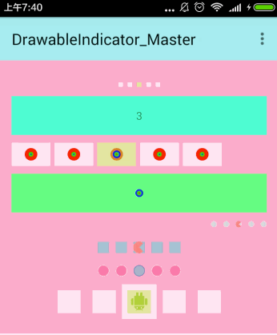

# DrawableIndicator_Master

Android drawable indicaotor for viewpager

## ScreenShot



## Include
- `maven`

``` xml
<dependency>
  <groupId>com.bobomee.android</groupId>
  <artifactId>drawableindicator</artifactId>
  <version>1.5</version>
  <type>aar</type>
</dependency>
```

- `gradle`

``` java
    compile 'com.bobomee.android:drawableindicator:1.5'
```
## Usage

### The Most Complex
in layout xml

``` xml
<!--with animation-->
<com.bobomee.android.drawableindicator.widget.AnimIndicator
                android:id="@+id/indicator1"
                android:layout_width="match_parent"
                android:layout_height="30dp"
                app:indicator_gravity="RIGHT"
                app:indicator_height="8dp"
                app:indicator_margin="8dp"
                app:indicator_moving_background="#00000000"
                app:indicator_moving_src="@drawable/banner_dot_select"
                app:indicator_background="#00000000"
                app:indicator_src="@drawable/banner_dot_unselect"
                app:indicator_isSnap="true"
                app:indicator_width="8dp" />
```

int Java Code

``` Java
private static <T extends View> T find(View view, int id) {
        return (T) view.findViewById(id);
    }
private void initBaseIndicator1() {
        AutoScrollViewPager viewPager = find(decorView, R.id.main_vp1);
        AnimIndicator baseIndicator = find(decorView, R.id.indicator1);
         baseIndicator.setUnselectAnimClass(RotateEnter.class)
                        .setSelectAnimClass(ZoomInEnter.class)
                        .setMovingAnimClass(RotateEnter.class)
                ;
        viewPager.setAdapter(new FragmentStateAdapter(getSupportFragmentManager()));
        viewPager.startAutoScroll();
        baseIndicator.setViewPagr(viewPager);
    }
```

### The Simplest
in layout xml

``` xml
<com.bobomee.android.scrollloopviewpager.autoscrollviewpager.AutoScrollViewPager
                android:id="@+id/main_vp3"
                android:layout_width="match_parent"
                android:layout_height="150dp" />
<com.bobomee.android.drawableindicator.widget.BaseIndicator
                android:id="@+id/indicator3"
                android:layout_width="match_parent"
                android:layout_height="30dp" />
```

int Java Code

``` Java
 private void initBaseIndicator3() {
        AutoScrollViewPager viewPager = find(decorView, R.id.main_vp3);
        BaseIndicator baseIndicator = find(decorView, R.id.indicator3);
        viewPager.setAdapter(new BasePagerAdapter());
        viewPager.startAutoScroll();
        baseIndicator.setViewPagr(viewPager);
    }
```

## Attributes

|name|format|description|
|:---:|:---:|:---:|
| indicator_width | dimension |the width of the indicator
| indicator_height | dimension |the height of the indicator
| indicator_margin | dimension |the margin between two indicator
| indicator_gravity | enum |Gravity.CENTER or RIGHT or LEFT,default CENTER
| indicator_moving_background | reference or color |indicator moving background drawable 
| indicator_background | reference or color |indicator background drawable 
| indicator_isSnap | boolean | draw offset or not,default true
| indicator_moving_src | reference or color |indicator moving src drawable
| indicator_src | reference or color |indicator src drawable


## Thanks

*   [imbryk/LoopingViewPager](https://github.com/imbryk/LoopingViewPager)
*   [Trinea/android-auto-scroll-view-pager](https://github.com/Trinea/android-auto-scroll-view-pager)
*   [H07000223/FlycoBanner_Master](https://github.com/H07000223/FlycoBanner_Master) 